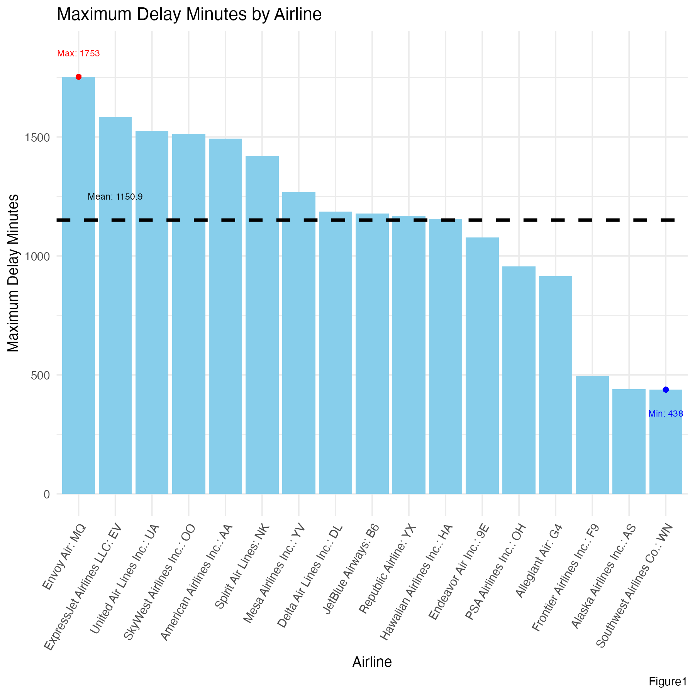
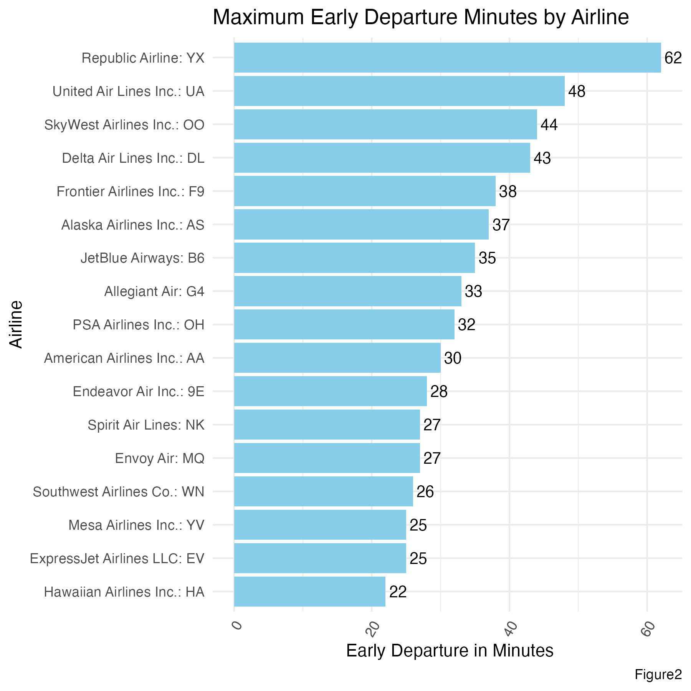
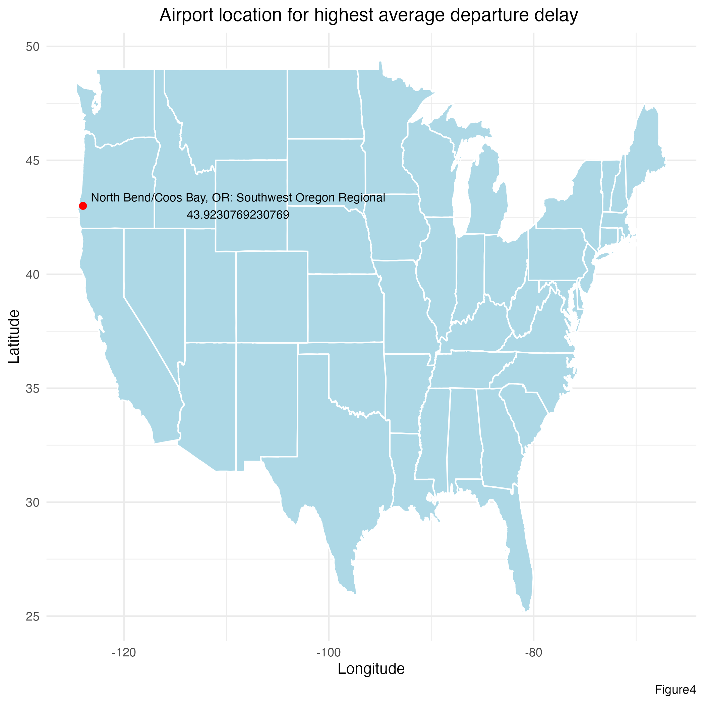
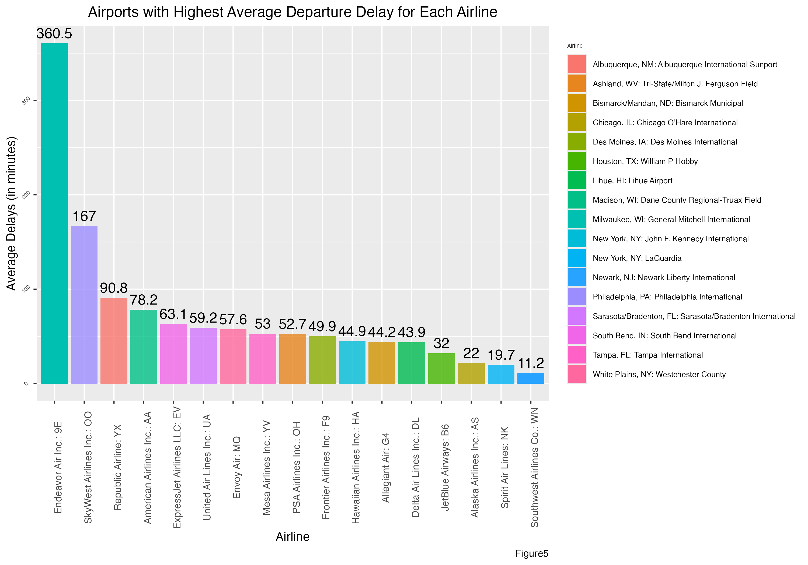
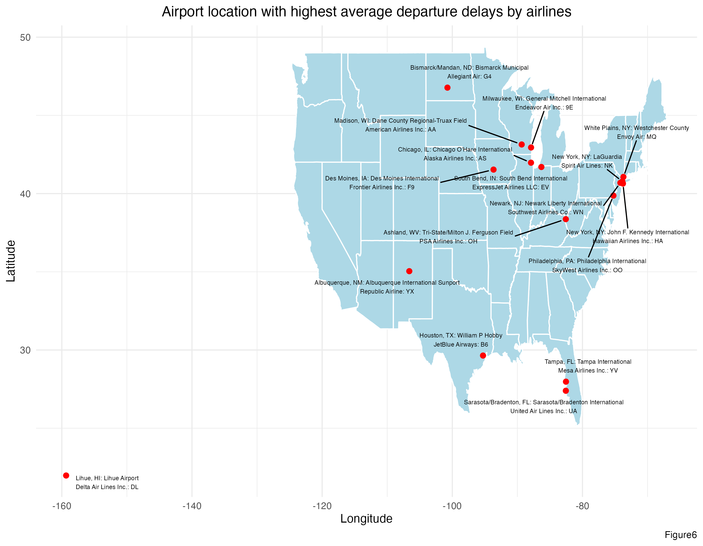

This section examines departure delay patterns across airlines and airports during September 2019. It is common for airlines to depart later than expected — or even early — due to various operational and environmental factors.

---

## 1. Maximum Departure Delay by Airline

Airlines differ widely in their worst-case delay performance. The chart below ranks all 17 airlines from longest to shortest maximum departure delay recorded in September 2019.

{fig-align="center" width="85%"}

::: {.key-finding}
**Key Finding:** Envoy Air had the longest single departure delay at **1,753 minutes**, while Southwest Airlines had the shortest maximum delay at **438 minutes**. The mean of all airlines' maximum delays was **1,150.9 minutes**.

Note: these are *maximum* delays — not averages — so even airlines that generally perform well can appear here due to one exceptional event.
:::

---

## 2. Maximum Early Departure by Airline

Flights can also depart *earlier* than scheduled. The chart below shows the maximum early departure (in absolute minutes) for each airline.

{fig-align="center" width="85%"}

::: {.key-finding}
**Key Finding:** Republic Airlines had the greatest early departure at **62 minutes** ahead of schedule. Hawaiian Airlines had the smallest maximum early departure at just **22 minutes** early.
:::

---

## 3. Airport with Highest Average Departure Delay

While the analyses above focused on individual airlines, airports also vary significantly in average departure performance.

### Table 1 — Airport with Highest Average Departure Delay {.unnumbered}

| Airport Name | Airport Code | Average Delay (minutes) |
|---|---|:---:|
| North Bend/Coos Bay, OR: Southwest Oregon Regional | 13694 | **43.92** |

::: {.key-finding}
**Key Finding:** **Southwest Oregon Regional Airport** (North Bend/Coos Bay, OR) had the highest average departure delay of approximately **43.92 minutes** among all airports in the dataset.
:::

The map below shows this airport's location in Oregon, USA.

{fig-align="center" width="80%"}

---

## 4. Highest Average Departure Delay Airport per Airline

Looking one level deeper: for each airline, which single airport produced the highest average departure delay?

{fig-align="center" width="95%"}

::: {.key-finding}
**Key Finding:** Most airlines' worst-airport average delays were under 100 minutes. However, two clear outliers stand out:

- **Endeavor Air** at General Mitchell International (Milwaukee): **360.5 min** average delay
- **SkyWest Airlines** at Philadelphia International: **167 min** average delay

At the other end, **Southwest Airlines** at Newark Liberty International had the lowest airline-specific average delay at just **11.2 minutes**, suggesting strong operational reliability across all airports.
:::

The map below shows the geographic distribution of these worst-performing airports for each airline.

{fig-align="center" width="90%"}
