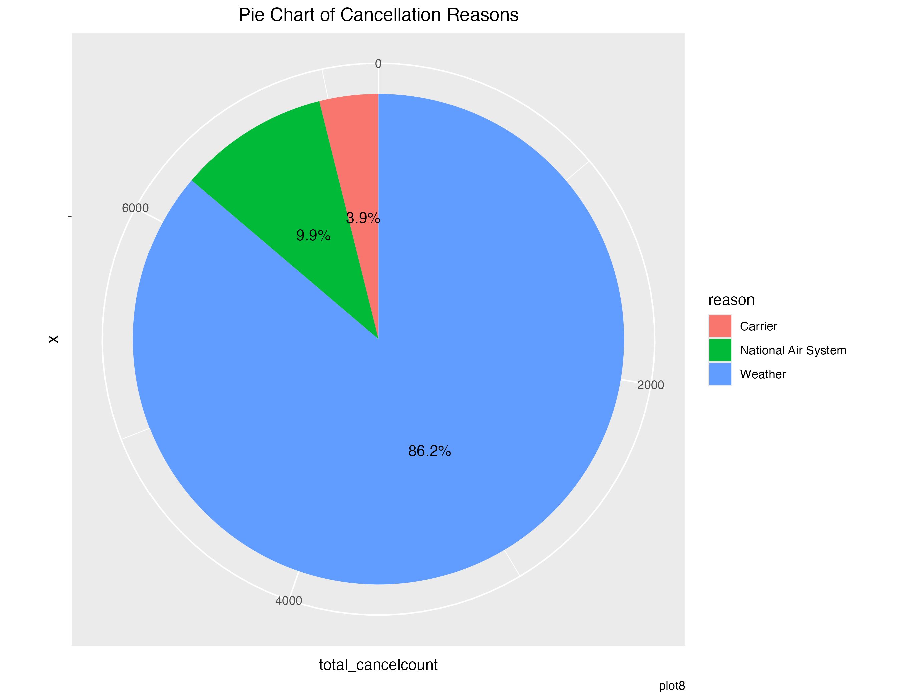
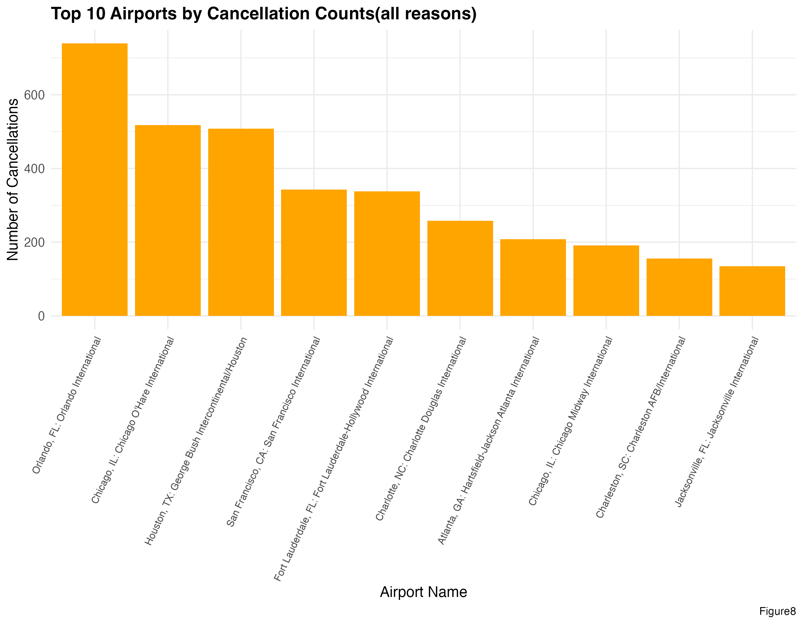

Beyond delays, some flights are cancelled entirely. This section examines how many flights were cancelled, the reasons behind them, and which airports were most affected during September 2019.

---

## Overall Cancellation Rate

### Table 3 — Cancelled vs. Operated Flights {.unnumbered}

| Flight Status | Number of Flights | Percentage |
|---|---:|:---:|
|  Operated | 595,964 | 98.3% |
|  Cancelled | 10,016 | 1.7% |

::: {.key-finding}
**Key Finding:** Of 605,979 total scheduled flights, **10,016 were cancelled** — a cancellation rate of **1.7%**. While this is a relatively low figure, it still represents over 10,000 disrupted journeys within a single month.
:::

---

## Cancellation Reasons Breakdown

The pie chart below breaks down the reasons for all 10,016 cancellations in September 2019.

{fig-align="center" width="75%"}

::: {.key-finding}
**Key Finding:** Weather was overwhelmingly the dominant cause of cancellations:

- **Weather:** 86.2%
- **National Air System:** 9.9%
- **Carrier:** 3.9%

This is consistent with September being **peak hurricane season** in the United States. Storms and severe weather events concentrated in the southern and coastal states drove the majority of cancellations.
:::

---

## Top 10 Airports by Cancellation Count

The bar chart below shows the 10 airports (out of 285 total) with the most cancellations during September 2019.

{fig-align="center" width="90%"}

::: {.key-finding}
**Key Finding:** The airports with the most cancellations are predominantly located in the **southern United States** — a region directly in the path of hurricane-season weather systems. This geographic pattern further supports the outsized role of weather as the primary cancellation driver in September 2019.
:::
