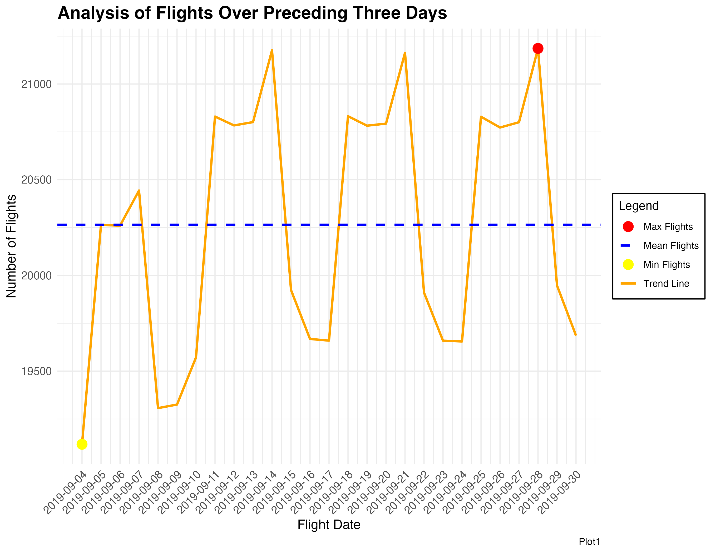

The total number of flights operated varies significantly by day of the week. Some days have higher travel demand while others are quieter. This section examines day-of-week flight volumes and rolling flight trends across September 2019.

---

## Day-of-Week Flight Volume Rankings

### Table 2 — Rank of Day in Week by Number of Flights Performed {.unnumbered}

| Day of the Week | Number of Flights | Rank |
|---|---:|:---:|
| Monday | 106,461 |  1 |
| Sunday | 99,427 |  2 |
| Thursday | 85,135 | 3 |
| Friday | 85,095 | 4 |
| Wednesday | 81,677 | 5 |
| Tuesday | 81,150 | 6 |
| Saturday | 67,034 |  7 |

**Summary Statistics:**

- **Mean flights/day:** 87,711.29
- **Total flights in September 2019:** 605,979

::: {.key-finding}
**Key Finding:** **Monday** was the single busiest day with over 106,000 flights — nearly 59% more than the quietest day, **Saturday** (67,034 flights). **Monday and Sunday** together account for a disproportionate share of weekly traffic, reflecting weekend travel patterns where passengers depart Sunday and return Monday.
:::

---

## Flights Over Preceding Three Days

The line chart below shows the total flights on each date, aggregated over a rolling 3-day window. The first three days (Sep 1–3) are excluded as they lack sufficient preceding history.

{fig-align="center" width="90%"}

::: {.key-finding}
**Key Finding:** The plot reveals a repeating 5-day pattern. Notably, **September 11, 18, and 25** (all Wednesdays) show sharp spikes in the 3-day rolling total. This is because these Wednesdays capture the cumulative flights of **Sunday + Monday + Tuesday** — the three busiest days of the week — in their preceding window.
:::
